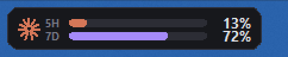

# Claude Usage Bar

A small always-on-top readout that sits on the left of the Windows taskbar and
shows your Claude limit usage — session (5h) and weekly (7d) — as two bars plus
percentages.



- **No dependencies.** Pure Python standard library (`tkinter`, `urllib`,
  `ctypes`). Nothing to `pip install`.
- **Light.** ~40 MB RSS, negligible idle CPU, one HTTPS request a minute.
- **Real numbers.** Reads the same endpoint the Claude Code CLI uses for
  `/usage`, so the percentages match what Settings shows — it does not estimate
  from local token logs.

## Install

Copy **two files** — `ClaudeUsageBar.pyw` and `claude_usage.py` — into the same
folder anywhere on the machine. That is the whole program; everything else in
this repo is documentation.

Then you need:

- **Windows** (10 or 11).
- **Python 3.8+** with tkinter, which the standard python.org installer includes
  by default. Check with `python -c "import tkinter"` — silence means you are
  fine.
- A **signed-in Claude Code CLI** (below).

## Requirements

One-time sign-in of the **Claude Code CLI**, because that is where the widget
reads your OAuth token from (`~/.claude/.credentials.json`):

```bash
claude
```

Sign in when prompted, then close it. The widget picks this up within a minute —
no restart needed. From then on it refreshes the token itself and keeps working.

If it is not signed in, the widget shows a red mark and `--`, and the tooltip
tells you what to do.

## Running it

```bash
pythonw "ClaudeUsageBar.pyw"
```

Use `pythonw.exe`, not `python.exe`, so no console window appears.

To start it automatically at login, right-click the widget and choose
**Start with Windows**. That writes a small launcher to your Startup folder
(`ClaudeUsageBar.vbs`); untick it to remove it.

## Using it

| Action | Result |
| --- | --- |
| Hover | Tooltip with exact percentages and when each window resets |
| Left-drag | Slide it sideways; the position is remembered |
| Double-click | Refresh immediately |
| Right-click | Refresh, autostart toggle, demo mode, config file, quit |

Colours: session is Claude orange, weekly is violet. Both turn **amber** at 75%
and **red** at 90%, so a glance is enough.

## Configuration

`config.json` is written next to the script (right-click → **Open config file**).

| Key | Default | Meaning |
| --- | --- | --- |
| `poll_seconds` | `60` | How often to refresh (minimum 10) |
| `x_offset` | `14` | Pixels from the left edge of the taskbar |
| `y_nudge` | `0` | Vertical fine-tuning |
| `scale` | `1.0` | Size multiplier, on top of DPI scaling |
| `show_labels` | `true` | Show the `5H` / `7D` labels |
| `warn_at` / `critical_at` | `75` / `90` | Amber and red thresholds |
| `hide_on_fullscreen` | `true` | Hide when a fullscreen app covers that monitor |
| `demo` | `false` | Animate fake values, for checking the look |

Changes apply on restart.

## Files

| File | Purpose |
| --- | --- |
| `ClaudeUsageBar.pyw` | The widget — window, drawing, interaction |
| `claude_usage.py` | Auth, token refresh, fetch, response normalising |
| `config.json` | Settings (created on first change) |

## How it gets the data

```
GET https://api.anthropic.com/api/oauth/usage
Authorization: Bearer <access token from ~/.claude/.credentials.json>
anthropic-beta: oauth-2025-04-20
```

When the access token expires, it refreshes against
`https://platform.claude.com/v1/oauth/token` using the stored refresh token and
the public Claude Code client ID, then writes the new tokens back to
`.credentials.json` — the same thing the CLI does, so the CLI keeps working.

Before its first write it copies your credentials file to
`.credentials.json.orig`, and keeps a rolling `.credentials.json.bak`. Writes are
atomic (temp file + replace). Your token is only ever sent to Anthropic's own
hosts, and is never logged or copied anywhere else.

### Checking the raw data

```bash
python claude_usage.py
```

Prints the raw JSON payload plus the parsed values. Useful if Anthropic ever
changes the shape of the response — the parser is deliberately tolerant (it
accepts several key spellings and both 0–100 and 0–1 scales), but this shows you
exactly what came back.

## Troubleshooting

If the widget misbehaves, check `claude-usage-bar.log` next to the script. It
records any unhandled exception. Under `pythonw.exe` there is no console, so
this file is the only place errors surface; an empty or missing file means
nothing has gone wrong.

**Staying above the taskbar.** Clicking the taskbar raises it above other
topmost windows, and it does not drop back on its own. The widget detects this
and re-enters the topmost band. It only does so when the taskbar itself is the
thing covering it, so it will not punch through the Start menu or other
flyouts.

## Notes and limits

- **Windows 11 removed taskbar toolbars** (deskbands), so this is a borderless
  always-on-top window positioned over the taskbar rather than hosted inside it.
  In practice it looks and behaves the same. It is marked as a tool window, so it
  never steals focus and never appears in Alt-Tab.
- It attaches to the **primary** taskbar and follows it if the bar moves or the
  resolution changes. On a vertical taskbar it hugs the top instead of centring.
- The weekly-Opus figure is not on the bars, but it is in the tooltip when the
  API reports it.
